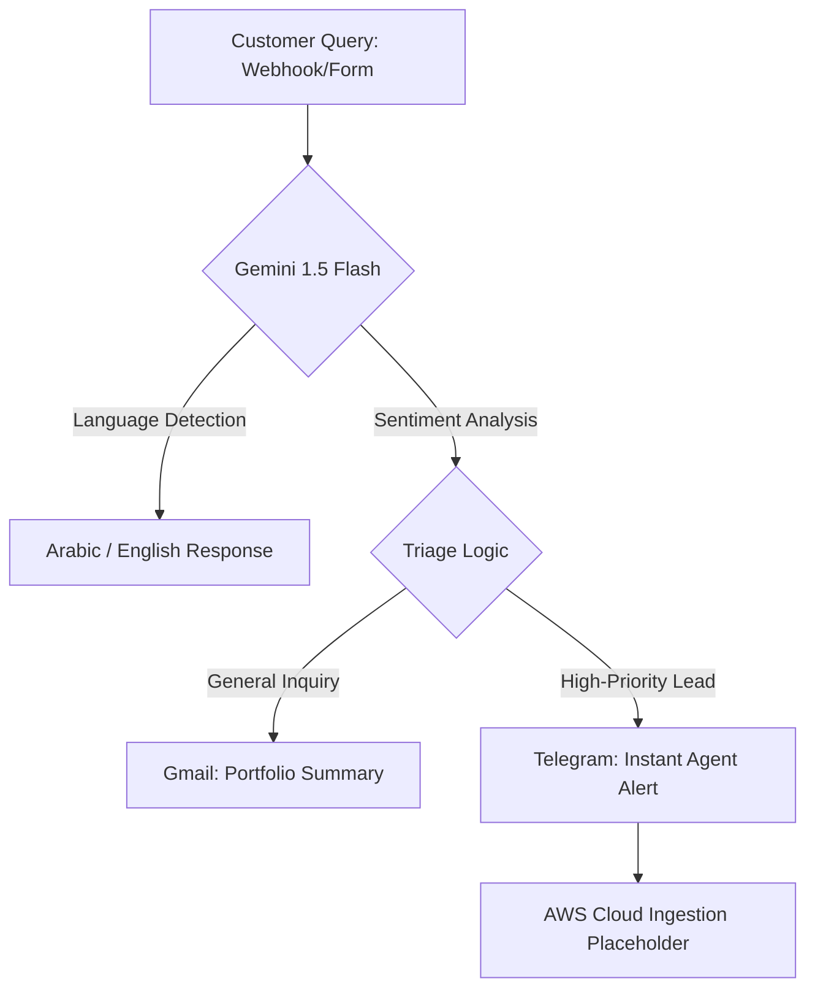
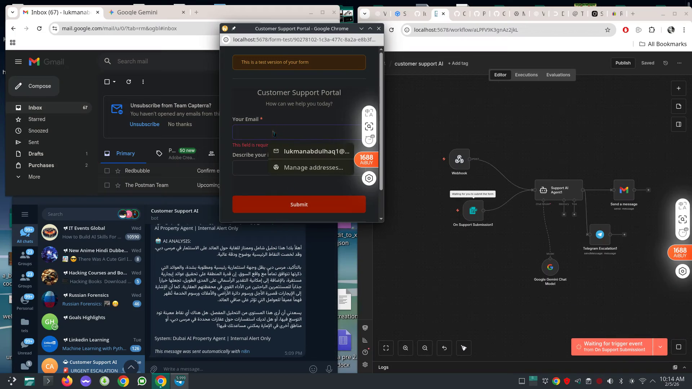
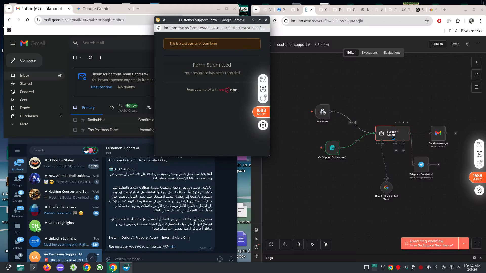

# 🏠 Dubai Real Estate AI Agent
### Autonomous Virtual Portfolio Manager & Lead Triage

## 🎯 Overview
An event-driven AI automation pipeline designed for the Dubai property market. This system handles multilingual inquiries, performs ROI calculations, and triages leads using sentiment analysis.

## 🏗️ Technical Architecture

### 📊 System Evidence
| Architecture Layout | Multilingual AI Response | Real-time Alert |
| :--- | :--- | :--- |
|  |  |  |

## 🛠️ Tech Stack
- **Orchestration**: n8n
- **Generative AI**: Google Gemini 1.5 Flash (NLP & Reasoning)
- **Integrations**: Gmail API, Telegram API
- **Foundations**: AWS Machine Learning & Generative AI Certified

---
*Maintained by Lukman Abdulhaq — AI Operations & Data Engineer*
