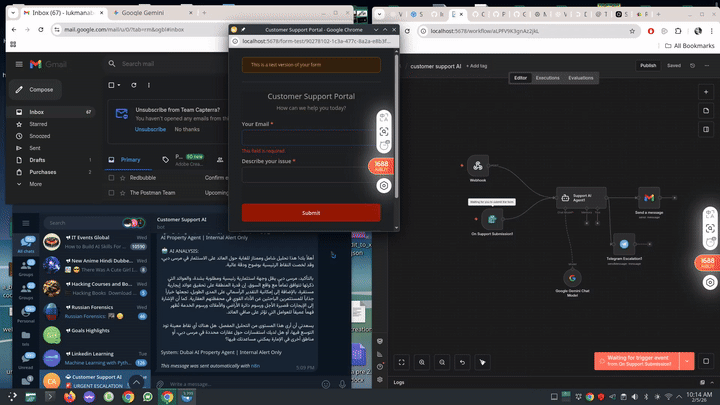

# 🏠 Dubai Real Estate AI Agent

### Autonomous Virtual Portfolio Manager & Lead Triage


## 🎥 System Demo

<div align="center">
  
</div>

> Short screen recording showing the agent handling customer queries, multilingual responses, sentiment triage, and real-time alerts.

## 🎯 Overview

An event-driven AI automation pipeline designed for the Dubai property market. This system handles multilingual inquiries (Arabic & English), performs ROI calculations, and triages leads using sentiment analysis.

## 🏗️ Technical Architecture

```mermaid
graph TD
    A[Customer Query: Webhook/Form] --> B{Gemini 1.5 Flash}
    B -->|Language Detection| C[Arabic / English Response]
    B -->|Sentiment Analysis| D{Triage Logic}
    D -->|General Inquiry| E[Gmail: Portfolio Summary]
    D -->|High-Priority Lead| F[Telegram: Instant Agent Alert]
    F --> G[AWS Cloud Ingestion Placeholder]
